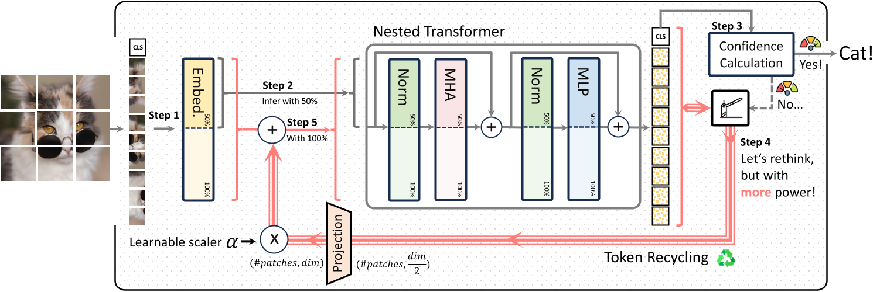

# 🚀 ThinkingViT: Matryoshka Thinking Vision Transformer for Elastic Inference

<div align="center">

***CVPR'2026 Main-Track Poster***

**[🌐 Project website](https://ds-kiel.github.io/ThinkingViT-project-page/)** · **[📄 Paper: arXiv:2507.10800](https://arxiv.org/abs/2507.10800)** · **[🤗 Hugging Face Paper](https://huggingface.co/papers/2507.10800)** · **[📦 Model weights: Zenodo](https://zenodo.org/records/20395084)**

</div>

Vision Transformers deliver state-of-the-art performance, yet their fixed computational budget prevents scalable deployment across heterogeneous hardware. Recent Matryoshka-based Transformer architectures mitigate this by embedding nested subnetworks within a single model to enable scalable inference. However, these models allocate the same amount of compute to all inputs, regardless of their complexity, which leads to inefficiencies. To address this, we introduce ThinkingViT, a nested ViT architecture that employs progressive thinking stages to dynamically adjust inference computation based on input difficulty. ThinkingViT initiates inference by activating a small subset of the most important attention heads and terminates early if predictions reach sufficient certainty. Otherwise, it activates additional attention heads and re-evaluates the input. At the core of ThinkingViT is our Token Recycling mechanism, which conditions each subsequent inference stage on the embeddings from the previous stage, enabling progressive improvement. Due to its backbone-preserving design, ThinkingViT also serves as a plugin upgrade for vanilla ViT. Experiments show that ThinkingViT surpasses nested baselines by up to 2.0 percentage points (p.p.) in accuracy at the same throughput and by up to 2.9 p.p. at equal GMACs on ImageNet-1K.

<div align="center">
  
</div>

## 📦 Installation

Create an environment and install dependencies:

```bash
python3 -m venv venv
source venv/bin/activate
pip install -r requirements.txt
```

The ImageNet-1K directory should follow the standard folder layout:

```text
ILSVRC2012/
├── train/
│   ├── n01440764/
│   └── ...
└── validation/
    ├── n01440764/
    └── ...
```

## 🎯 ThinkingViT on DeiT

Training uses `train.py` through the provided distributed launcher. The main recipe is stored in `args.yaml`.

### Two-stage ThinkingViT: `3H -> 6H`

```bash
./distributed_train.sh 2 \
  --config args.yaml \
  --model thinkingvit \
  --batch-size 512 \
  --data /path/to/ILSVRC2012/ \
  --initial-checkpoint /path/to/initial-checkpoint.pth.tar \
  --thinking_stages 3 6 \
  --eval-every 10
```

### ThinkingViT training arguments

- `--config args.yaml`: loads the DeiT-style training recipe, including optimizer, augmentation, scheduler, EMA, and regularization settings.
- `--model thinkingvit`: uses the registered ThinkingViT constructor instead of a vanilla DeiT constructor.
- `--data` / `--data-dir`: ImageNet-1K root directory containing `train/` and `validation/`.
- `--batch-size`: per-process training batch size. The effective global batch size is `batch-size * number-of-GPUs * grad-accum-steps`.
- `--initial-checkpoint`: optional checkpoint used to initialize the model before training.
- `--thinking_stages 3 6`: defines the two ThinkingViT stages. The first stage uses 3 attention heads; difficult samples continue to the 6-head stage during evaluation.
- `--eval-every K`: runs validation every `K` epochs. This only changes how often validation is run; it does not change training updates.

Training outputs are written under:

```text
output/train/<timestamp>-thinkingvit-224/
```

## 🛠️ ThinkingViT on DeiT Evaluation

Use `validate.py` for ImageNet validation.

### Evaluation arguments

- `--checkpoint`: path to the trained ThinkingViT checkpoint.
- `--use-ema`: evaluates the EMA weights stored in the checkpoint when available.
- `--threshold`: entropy threshold for early exit. Lower thresholds send more samples to the later stage and increase GMACs; higher thresholds exit earlier and reduce GMACs.
- `--batch-size`: validation batch size.

### Threshold evaluation

```bash
python validate.py \
  --model thinkingvit \
  --checkpoint /path/to/thinkingvit_checkpoint.pth.tar \
  --data-dir /path/to/ILSVRC2012/ \
  --batch-size 512 \
  --use-ema \
  --thinking_stages 3 6 \
  --threshold 1.0
```

### Full second-stage accuracy

Use a low threshold to send almost all samples to the later stage:

```bash
python validate.py \
  --model thinkingvit \
  --checkpoint /path/to/thinkingvit_checkpoint.pth.tar \
  --data-dir /path/to/ILSVRC2012/ \
  --batch-size 512 \
  --use-ema \
  --thinking_stages 3 6 \
  --threshold 0.0
```

### First-stage accuracy

Use a high threshold to exit at the first stage:

```bash
python validate.py \
  --model thinkingvit \
  --checkpoint /path/to/thinkingvit_checkpoint.pth.tar \
  --data-dir /path/to/ILSVRC2012/ \
  --batch-size 512 \
  --use-ema \
  --thinking_stages 3 6 \
  --threshold 10.0
```

Evaluation prints the overall accuracy, per-stage dispatch rate, per-stage accuracy, and GMACs.

For a Slurm threshold sweep with the DeiT-based model, edit the `THRESHOLDS` list in `job_eval.sh` and run:

```bash
sbatch job_eval.sh
```

## 📊 ImageNet-1K Results

**ThinkingViT is architecture agnostic. The DeiT-based models below are built on top of the vanilla DeiT architecture. While ThinkingViT can outperform the corresponding DeiT baseline, the absolute accuracy is still limited by the capacity of that backbone. As shown by the Swin-based ThinkingViT results later, applying the same idea to a stronger architecture can reach higher accuracy.**

Performance of **ThinkingViT `3H -> 6H`** and **ThinkingViT `3H -> 6H` 800 epochs** across entropy thresholds.

| Threshold | ThinkingViT `3H -> 6H` Acc@1 (%) | ThinkingViT `3H -> 6H` GMACs | ThinkingViT `3H -> 6H` 800 Epochs Acc@1 (%) | ThinkingViT `3H -> 6H` 800 Epochs GMACs |
|---:|---:|---:|---:|---:|
| 0.0 | 81.440 | 5.850 | 81.850 | 5.850 |
| 0.1 | 81.440 | 5.474 | 81.848 | 5.385 |
| 0.2 | 81.436 | 4.870 | 81.846 | 4.751 |
| 0.3 | 81.418 | 4.494 | 81.832 | 4.363 |
| 0.5 | 81.368 | 3.977 | 81.758 | 3.841 |
| 0.8 | 80.980 | 3.319 | 81.386 | 3.189 |
| 1.0 | 80.310 | 2.907 | 80.636 | 2.781 |
| 1.2 | 79.462 | 2.543 | 79.764 | 2.433 |
| 1.4 | 78.502 | 2.223 | 78.846 | 2.136 |
| 1.6 | 77.292 | 1.944 | 77.688 | 1.865 |
| 2.0 | 74.712 | 1.441 | 75.500 | 1.417 |
| 5.0 | 73.536 | 1.250 | 74.514 | 1.250 |
| 10.0 | 73.536 | 1.250 | 74.514 | 1.250 |

Lower thresholds activate later stages more often and improve accuracy at higher compute. Higher thresholds exit earlier and reduce GMACs.

## 🎯 ThinkingViT on Swin Transformer

Swin training uses `train_swin.py` and the recipe in `args_swin.yaml`. The head schedule is passed as two Swin rounds, with one head count per Swin stage. Swin-S has four stages, so each round is specified with four values. For Swin-S, the first thinking round keeps the full capacity of the first stage and uses half of the attention heads in the last three stages, where most layers and attention heads are concentrated. The second round then runs the full Swin-S capacity. In the default setup, this corresponds to `(3, 3, 6, 12) -> (3, 6, 12, 24)`.

```bash
torchrun --nproc_per_node=4 train_swin.py \
  --config args_swin.yaml \
  --model swin_small_patch4_window7_224 \
  --pretrained \
  --data-dir /path/to/ILSVRC2012/ \
  --head-round-1 3 3 6 12 \
  --head-round-2 3 6 12 24
```

The same command is available as a Slurm job:

```bash
sbatch job_train_swin.sh
```

### ThinkingViT-Swin training arguments

- `--config args_swin.yaml`: loads the Swin-S training recipe.
- `--model swin_small_patch4_window7_224`: uses Swin-S at 224x224 resolution.
- `--pretrained`: initializes from the built-in timm pretrained Swin-S weights.
- `--head-round-1 3 3 6 12`: first Swin thinking round. The four values correspond to Swin-S stages 1-4 and allocate 3, 3, 6, and 12 heads respectively.
- `--head-round-2 3 6 12 24`: second Swin thinking round. The four values again correspond to stages 1-4 and use the full Swin-S stage widths.

## 🛠️ ThinkingViT on Swin Transformer Validation

Use `validate_swin.py` for Swin threshold evaluation:

```bash
python validate_swin.py \
  --model swin_small_patch4_window7_224 \
  --checkpoint /path/to/ThinkingViTSwin.pth.tar \
  --data-dir /path/to/ILSVRC2012/ \
  --batch-size 128 \
  --use-ema \
  --head-round-1 3 3 6 12 \
  --head-round-2 3 6 12 24 \
  --threshold 1.0
```

To calculate the per-round Swin GMACs for a head schedule:

```bash
python calc_swin_gmacs.py \
  --model swin_small_patch4_window7_224 \
  --head-round-1 3 3 6 12 \
  --head-round-2 3 6 12 24
```

For a Slurm threshold sweep, edit the `THRESHOLDS` list in `job_eval_swin.sh` and run:

```bash
sbatch job_eval_swin.sh
```

## 📊 ThinkingViT-Swin Results

Performance of **ThinkingViT-Swin / Swin-S** with head rounds `(3, 3, 6, 12) -> (3, 6, 12, 24)`, copied from `eval_logs_swin/summary.md`.

| Threshold | Acc@1 (%) | GMACs |
|---:|---:|---:|
| 0.0 | 83.516 | 11.68 |
| 0.1 | 83.516 | 9.60 |
| 0.2 | 83.504 | 8.41 |
| 0.3 | 83.484 | 7.72 |
| 0.5 | 83.386 | 6.76 |
| 0.8 | 82.886 | 5.56 |
| 1.0 | 82.124 | 4.88 |
| 1.2 | 81.260 | 4.34 |
| 1.4 | 80.464 | 3.89 |
| 1.6 | 79.746 | 3.53 |
| 2.0 | 78.410 | 2.97 |
| 5.0 | 77.990 | 2.82 |

## 🤗 Pretrained Models on Hugging Face

The ImageNet-1K EMA checkpoints are available on Hugging Face Hub:

| Model | Hub repository | Notes |
|---|---|---|
| ThinkingViT-DeiT `3H -> 6H` | [NCPS/thinkingvit_deit-3h-6h-imagenet1k](https://huggingface.co/NCPS/thinkingvit_deit-3h-6h-imagenet1k) | DeiT-style ThinkingViT with two thinking stages. |
| ThinkingViT-DeiT `3H -> 6H` 800 epochs | [NCPS/thinkingvit_deit-3h-6h-800epochs-imagenet1k](https://huggingface.co/NCPS/thinkingvit_deit-3h-6h-800epochs-imagenet1k) | 800-epoch DeiT-style ThinkingViT with two thinking stages. |
| ThinkingViT-Swin / Swin-S | [NCPS/thinkingvit-swin-s-imagenet1k](https://huggingface.co/NCPS/thinkingvit-swin-s-imagenet1k) | Swin-S with head rounds `(3, 3, 6, 12) -> (3, 6, 12, 24)`. |

Use the models from this repository root so Python imports the custom local `timm` implementation.

### Load ThinkingViT-DeiT from Hugging Face

```python
import torch
from timm.models import create_model

model = create_model(
    "hf-hub:NCPS/thinkingvit_deit-3h-6h-imagenet1k",
    pretrained=True,
)
model.eval()

x = torch.randn(1, 3, 224, 224)
with torch.no_grad():
    logits, stage = model(x, threshold=1.0)

print(logits.shape)  # (1, 1000)
print(stage)         # 0 = 3 heads, 1 = 6 heads
```

### Load ThinkingViT-Swin from Hugging Face

```python
import torch
from timm.models import create_model

model = create_model(
    "hf-hub:NCPS/thinkingvit-swin-s-imagenet1k",
    pretrained=True,
)
model.eval()

x = torch.randn(1, 3, 224, 224)
with torch.no_grad():
    logits, stage = model(x, threshold=1.0)

print(logits.shape)  # (1, 1000)
print(stage)         # 0 = reduced-head round, 1 = full Swin-S round
```

The entropy threshold controls early exit. Lower thresholds send more samples to later stages and improve accuracy at higher compute; higher thresholds exit earlier and reduce compute.

For a quick end-to-end test with an image, use:

```bash
python scripts/test_hf_thinkingvit_deit.py \
  --image sample_images/labrador_dog.jpg \
  --threshold 1.0
```

## 📁 Useful Files

- `train.py`: ImageNet training entry point.
- `validate.py`: ImageNet validation and threshold evaluation.
- `args.yaml`: DeiT-style training recipe for ThinkingViT.
- `train_swin.py`: ImageNet training entry point for ThinkingViT-Swin.
- `validate_swin.py`: Swin validation and threshold evaluation.
- `args_swin.yaml`: Swin-S training recipe.
- `calc_swin_gmacs.py`: per-round GMAC calculator for ThinkingViT-Swin.
- `scripts/export_hf_models.py`: exports local checkpoints to Hugging Face Hub-ready model folders.
- `scripts/test_hf_thinkingvit_deit.py`: quick Hugging Face inference smoke test for ThinkingViT-DeiT.
- `job_train_swin.sh`: Slurm launcher for Swin training.
- `job_eval_swin.sh`: Slurm threshold sweep for Swin evaluation.
- `distributed_train.sh`: small `torchrun` launcher.
- `timm/models/vision_transformer.py`: ThinkingViT model registration and ViT implementation.
- `timm/models/swin_transformer.py`: ThinkingViT-Swin head-round implementation.

## 🙏 Acknowledgements

This repository builds on [pytorch-image-models (timm)](https://github.com/huggingface/pytorch-image-models) and also draws inspiration from the [HydraViT](https://github.com/ds-kiel/HydraViT) repository.
