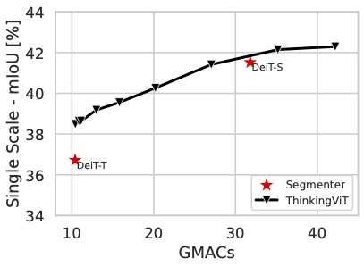
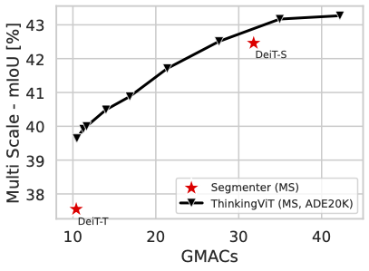
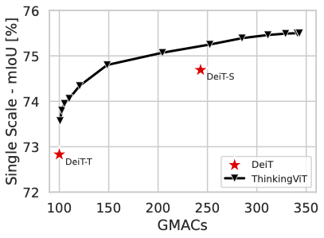
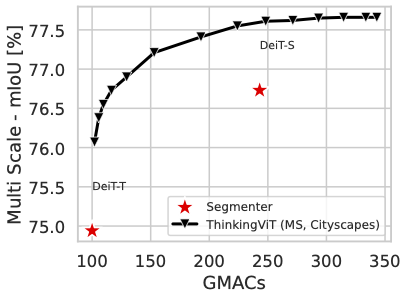

# ThinkingViT on Segmenter: Semantic Segmentation Evaluation

This directory evaluates ThinkingViT for semantic segmentation by adapting the Segmenter pipeline with ThinkingViT checkpoints. The released checkpoints finetune a pretrained ThinkingViT backbone with the linear Segmenter decoder on ADE20K and Cityscapes.

## Setup

- **Environment**  
  Follow the official Segmenter installation steps: https://github.com/rstrudel/segmenter/tree/master

- **Datasets**  
  Use the Segmenter dataset scripts to download ADE20K and Cityscapes. Point the environment variable to the dataset parent directory:
  ```bash
  export DATASET=/path/to/datasets
  ```

- **Checkpoints**  
  Download the ADE20K and Cityscapes checkpoints for ThinkingViT Segmenter here and place it in the corresponding directory: https://zenodo.org/records/17507118

## Evaluation

### ADE20K (single scale - 512x512)

```bash
python -m segm.eval.miou ThinkingViT_3_6_Segmenter_ade.pth.tar ade20k \
  --singlescale \
  --thinking-stages "3,6" \
  --thinking-threshold [THRESHOLD]\
  --stage-flops "10.4, 42.2"
```

------

Single-scale results:

<div align="center">
  
</div>


------

Multi-scale evaluation is available via `--multiscale`:
<div align="center">
  
</div>
------


### Cityscapes (single scale - 1024x1024)

```bash
python -m segm.eval.miou ThinkingViT_3_6_Segmenter_cityscapes.pth.tar cityscapes \
  --singlescale \
  --thinking-stages "3,6" \
  --thinking-threshold [THRESHOLD]\
  --stage-flops "100, 343"
```

------
Single-scale results:

<div align="center">
  
</div>

------

Multi-scale evaluation is available via `--multiscale`:

<div align="center">
  
</div>